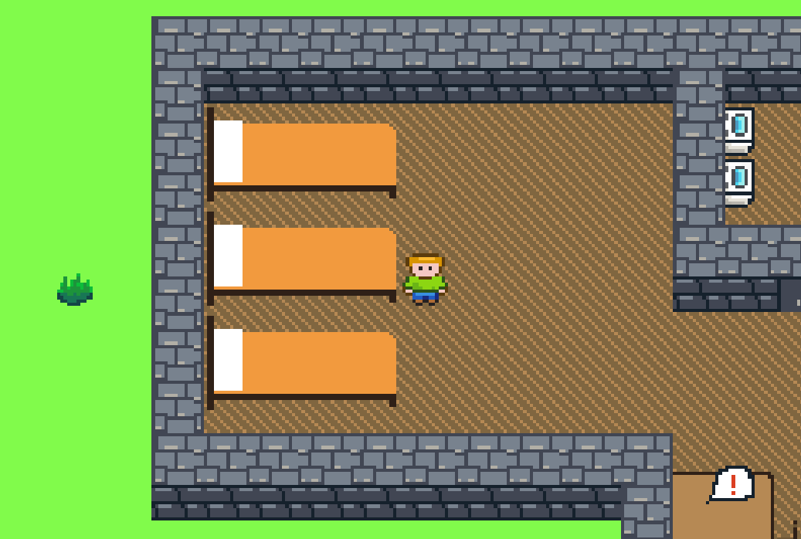

<p align=center>
    
    <h3 align=center>Periculum &mdash; a game about a contagion environment</h3>
</p>

# Installation
### JAR
Head over to the [releases section](https://github.com/TheAvidDev/periculum/releases) and grab the latest JAR file. This game is built for Java 8, so make sure to have the appropriate JRE. Builds for other versions are coming soon. To run this JAR file, either double click it or launch it from the command line with:
```sh
java -jar <release name>.jar
```
### From Source
To build and play the absolute latest version of the game from source, do the following:
 - Clone the repo with `git clone https://github.com/TheAvidDev/periculum.git`.
 - Open Eclipse IDE (other IDEs will also work, but require some setup not explained here).
 - Press `File > Import` then select `Gradle > Existing Gradle Project`.
 - Keep clicking `Next` until you can select the `Project root directory` at which point select the cloned repo and hit `Finish`.
 - Press the `Run` button after opening up the `DesktopLauncher.java` in `periculum-desktop > src > dev.theavid.periculum.desktop`.
 
 # Sources
 This project was created by [@hirundinidae](https://github.com/hirundinidae) and [@TheAvidDev](https://github.com/TheAvidDev).
 
 This game is built with [libGDX](https://libgdx.badlogicgames.com/) so lots of research was required. Some in-game assets such as music and fonts were also found online. Below is an incomplete list of the sources we used, with complete links used where possible.
  - https://libgdx.badlogicgames.com/
  - https://www.badlogicgames.com/forum/
  - https://fluentcolors.com/
  - https://stackoverflow.com/
  - https://gradle.org/
  - http://unifoundry.com/unifont/index.html
  - https://opengameart.org/content/town-theme-rpg
  - https://opengameart.org/content/loading-screen-loop
  - https://opengameart.org/content/game-over-0 (converted wav -> mp3)
  - https://opengameart.org/content/victory-fanfare-short (converted wav -> mp3)
